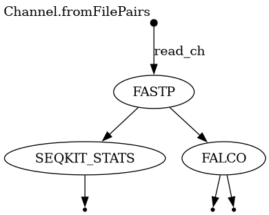

# BIOL7210 Workflow Exercise: Genomics Pipeline
**Student:**  Thejaswini Krishna

## Workflow Overview
This Nextflow DSL2 pipeline is designed for computational genomics, demonstrating both sequential and parallel task execution.

* **Step 1 (Sequential):** Raw FastQ reads are processed by **fastp** for adapter trimming and quality filtering.
* **Step 2 (Parallel):** The trimmed reads are simultaneously processed by **SeqKit** (for descriptive statistics) and **FastQC** (for quality visualization).

## Workflow Diagram
The following image illustrates the dependency flow (Sequential -> Parallel):

## Requirements & Environment
To satisfy the requirements for this exercise, the following environment was used:
* **Operating System:** Linux
* **Architecture:** x86_64
* **Nextflow Version:** 25.10.4
* **Package Manager:** Conda 26.3.2
* **Workflow Language:** Nextflow DSL2

## Test Data
The repository includes a "mini" test dataset derived from *E. coli* subsets:
* Location: `data/`
* Files: `test_1.fastq.gz`, `test_2.fastq.gz`

## Instructions to Run (Workflow Test)
These three commands allow for a full execution of the pipeline in under 30 minutes:

1. **Activate Environment:**
   `conda activate nf_env`

2. **Execute Workflow:**
   `nextflow run main.nf -with-dag dag.png`

3. **View Results:**
   Check the generated `results/` directory for `stats/` and `qc/` outputs.

---
*Note: This repository was created for the BIOL7210 course at Georgia Tech.*
